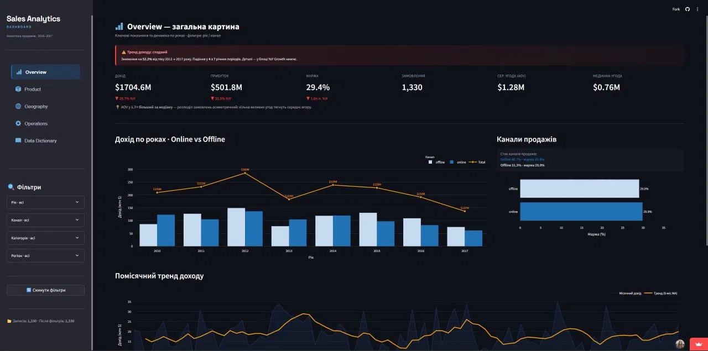
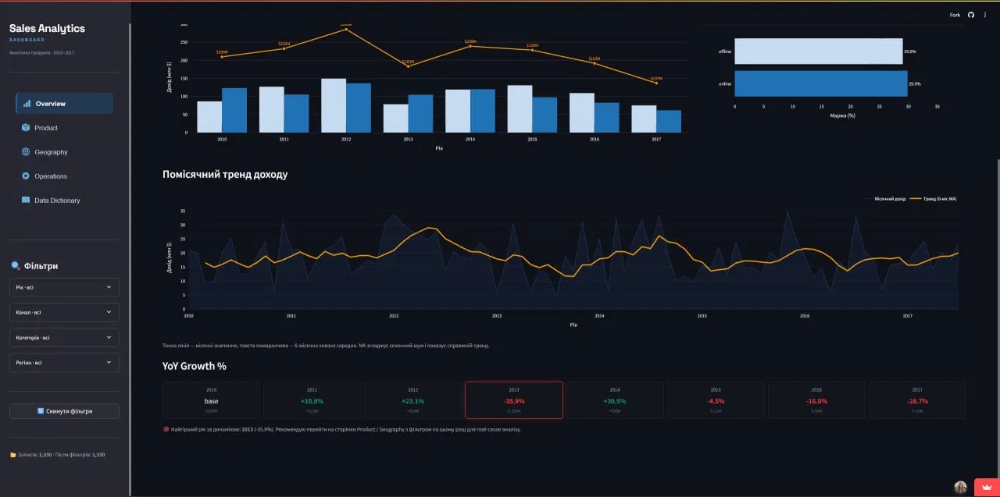
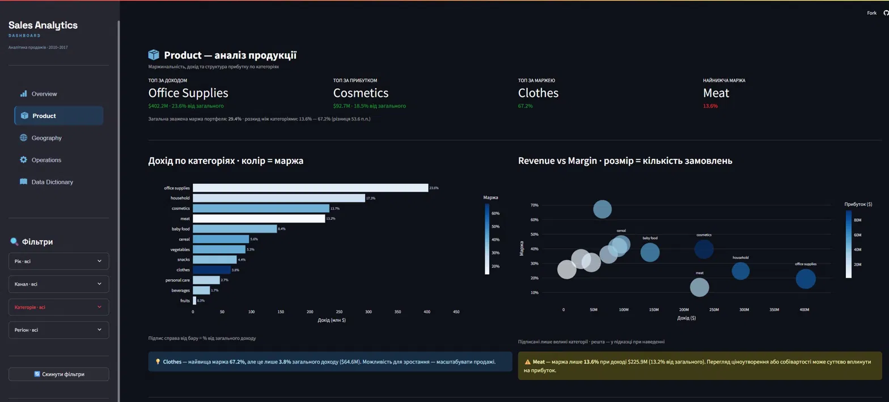
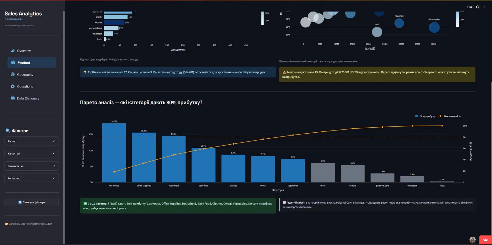
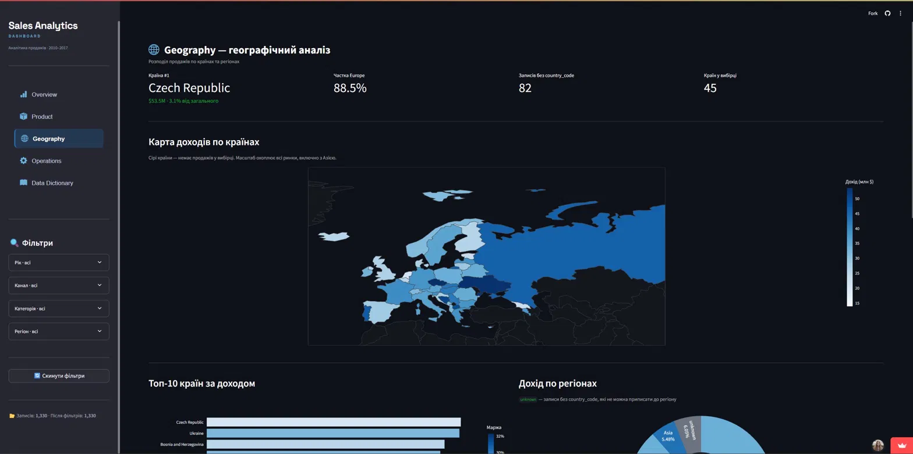
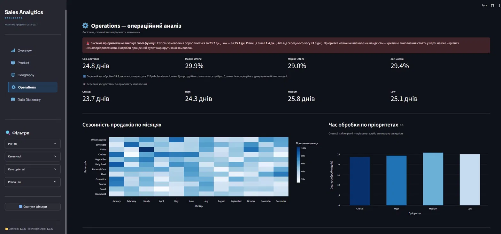
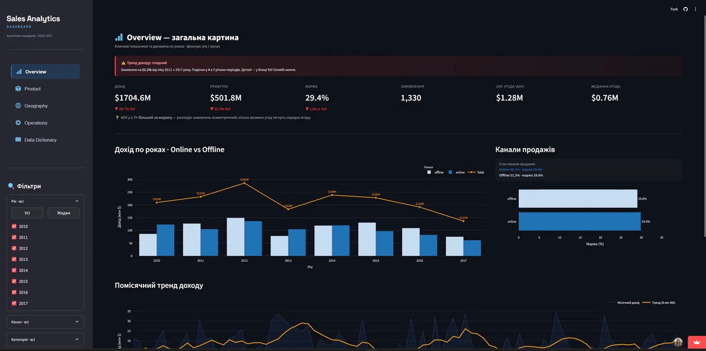
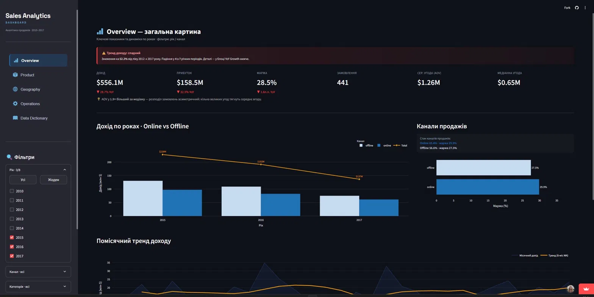

# Sales Analytics Dashboard

End-to-end аналітичний продукт: від сирих CSV до задеплоєного веб-застосунку.

**[▶ Live Demo](https://sales-dashboard-analytics.streamlit.app)** · Python · Streamlit · Pandas · Plotly · SQLite

---

## Overview

Дашборд аналізує 1 330 транзакцій продажів за 2010–2017 роки по 45 країнах.
Мета — не просто візуалізація даних, а actionable insights для бізнес-рішень.



---

## Архітектура
Проєкт побудований за ETL + layered architecture патерном:
```text
sales-dashboard/
├── main.py                    # entry point, routing
├── app/
│   ├── components/            # reusable UI (filters, header)
│   ├── pages/                 # 5 analytical views
│   └── services/
│       ├── data_loader.py     # ETL pipeline
│       ├── database.py        # SQLite layer
│       └── metrics.py         # business metrics
├── data/
│   ├── raw/                   # immutable source files
│   └── processed/             # generated SQLite DB
└── tests/                     # pytest unit + integration tests
```

**Ключові архітектурні рішення:**
- `@st.cache_data` — ETL pipeline виконується один раз при старті
- Розподіл pandas (динамічні KPI) і SQL (статичні агрегації) за призначенням
- `df.copy()` скрізь — захист від мутації оригінальних даних
- Defensive programming — обробка edge cases на кожному рівні

---

## Аналітичні сторінки

### Overview — executive summary


KPI з YoY delta, автоматичний alert при спадній динаміці, 6-місячна ковзна середня.
YoY метрики рахуються на повному датасеті — delta стабільна незалежно від фільтрів.



---

### Product — портфельний аналіз


Зважена маржа `SUM(profit)/SUM(revenue)` замість `AVG(margin)` — методологічно коректна агрегація.



Парето: 7 з 12 категорій (58%) генерують 80% прибутку.

---

### Geography — географічний розподіл


88.5% доходу з Європи — критична концентрація. Choropleth карта + субрегіональна деталізація.
82 записи без `country_code` показуються явно як data gap, не приховуються.

---

### Operations — операційна ефективність


Автоматична SLA перевірка: Critical замовлення обробляються за 23.7 дн., Low — 25.1 дн.
Різниця 1.4 дн. (~6%) — система пріоритетів фактично не працює.

---

### Інтерактивні фільтри

| Всі роки · $1704.6M | 2015–2017 · $556.1M |
|---|---|
|  |  |

Фільтри по року, каналу, категорії та регіону. Стан зберігається в `session_state`.

---

## Data Quality

| Метрика | Значення |
|---|---|
| Записів | 1 330 |
| Пропусків після очищення | 0 |
| Дублікатів | 0 |
| Колонок у фінальному df | 22 (10 сирих + 12 похідних) |

**Нетривіальні кейси очищення:**
- Namibia ISO code `NA` → pandas читає як `NaN` → відновлено вручну через `.loc`
- 82 записи без `country_code` → збережено як `unknown`, не видалено
- `units_sold` пропуски → медіана (стійка до викидів на відміну від mean)

---

## Технічний стек

Python 3.11    Streamlit 1.35    Pandas 2.2.2
Plotly 5.22    SQLite            pytest

## Запуск

```bash
pip install -r requirements.txt
streamlit run main.py
pytest tests/
```