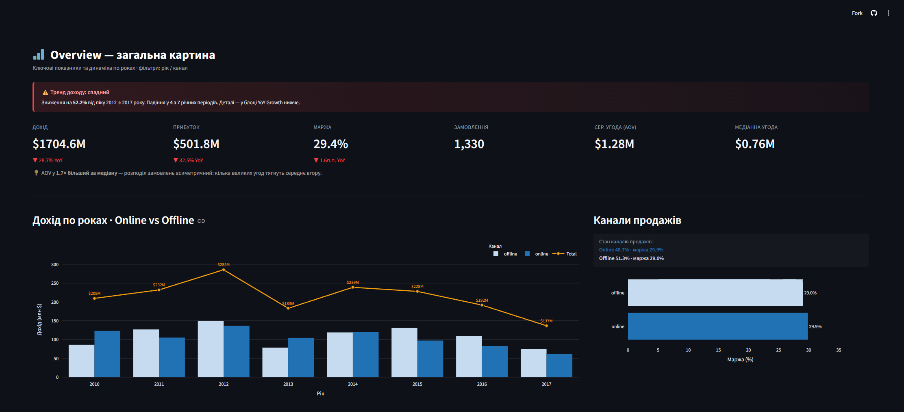
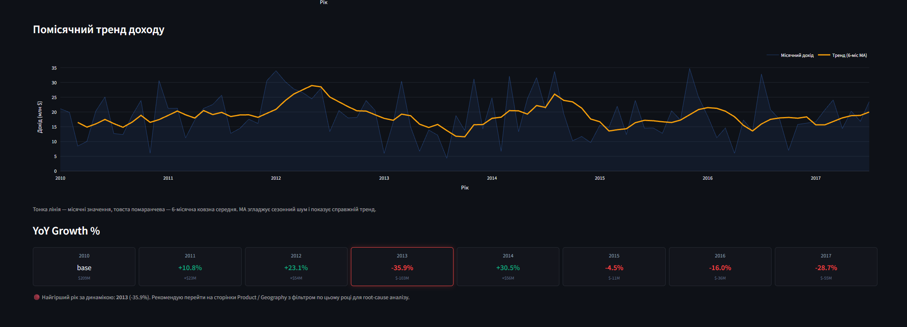
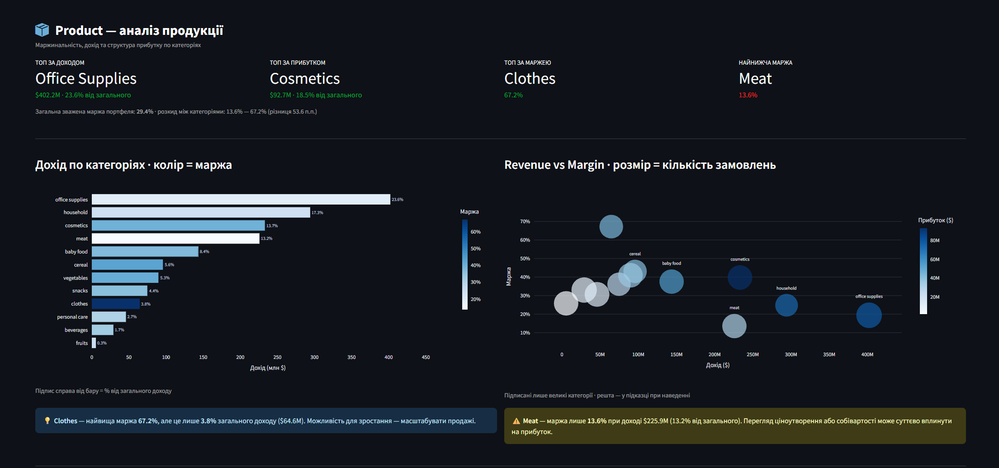
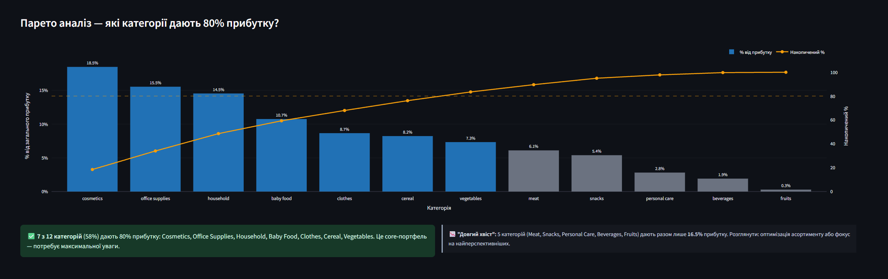
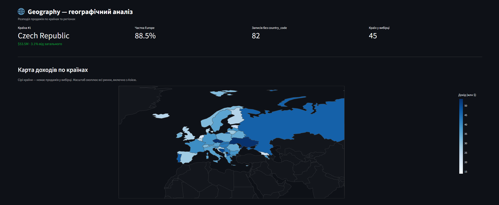
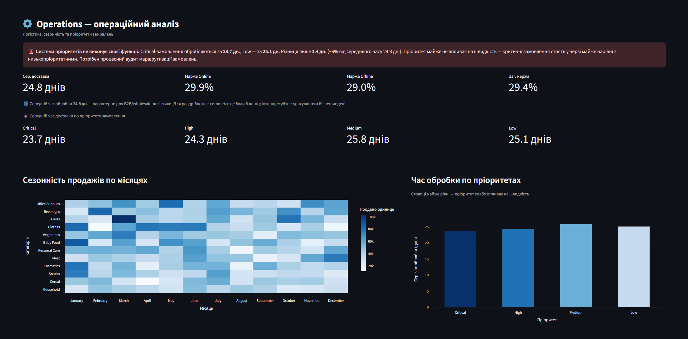
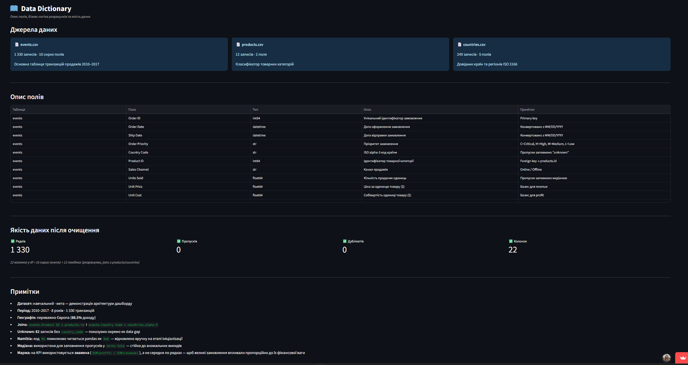
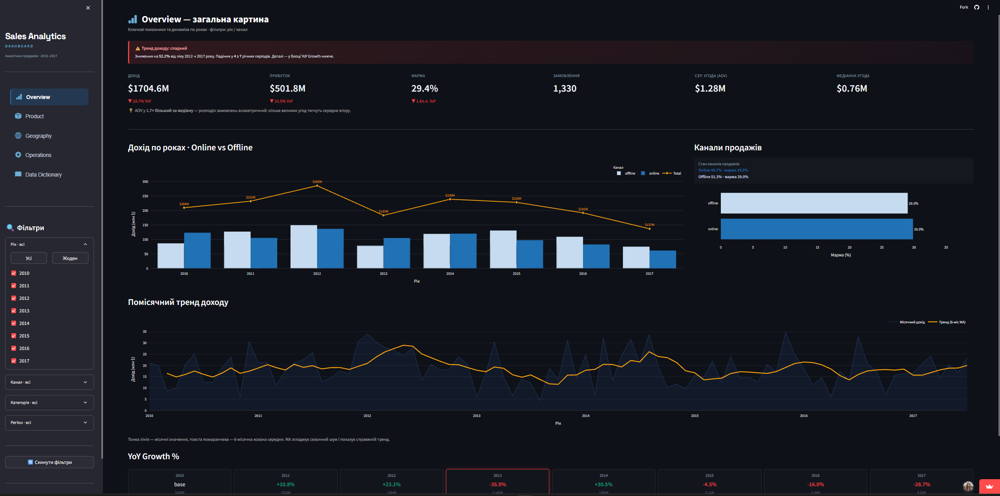
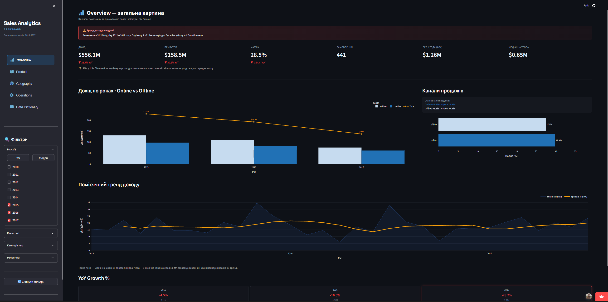

# Sales Analytics Dashboard

End-to-end аналітичний продукт: від сирих CSV до задеплоєного веб-застосунку.

**[▶ Live Demo](https://sales-dashboard-analytics.streamlit.app)** &nbsp;|&nbsp; Python &nbsp;|&nbsp; Streamlit &nbsp;|&nbsp; Pandas &nbsp;|&nbsp; Plotly &nbsp;|&nbsp; SQLite

---

## Про проєкт

Інтерактивний дашборд аналізує **1 330 транзакцій** продажів за 2010–2017 роки по 45 країнах.
Мета — **actionable insights** для бізнес-рішень:
автоматичне виявлення аномалій, Парето аналіз портфеля, SLA перевірка операційної ефективності.



---

---

## Технічний стек

| | | | | |
|---|---|---|---|---|
|  |  |  |  |  |

*Додатково використовується:* `streamlit-option-menu>=0.3.6` (для побудови кастомної інтуїтивної навігації між аналітичними сторінками).

---

---

## Аналітичні сторінки

### Overview — executive summary


KPI з YoY delta, автоматичний alert при спадній динаміці, 6-місячна ковзна середня для згладжування сезонного шуму. YoY метрики рахуються на повному датасеті — delta стабільна незалежно від активних фільтрів.

---

### Product — портфельний аналіз


Зважена маржа `SUM(profit)/SUM(revenue)` замість `AVG(margin)` — методологічно коректна агрегація що враховує розмір кожної угоди.



**Парето результат:** 7 з 12 категорій (58%) генерують 80% прибутку. Автоматичне виділення core-портфеля і "довгого хвоста".

---

### Geography — географічний розподіл


Choropleth карта + субрегіональна деталізація. **88.5% доходу з Європи** — критична концентрація що потребує диверсифікації. 82 записи без `country_code` показуються явно як data gap.

---

### Operations — операційна ефективність


Автоматична SLA перевірка: Critical замовлення обробляються за 23.7 дн., Low — 25.1 дн. Різниця лише 1.4 дн. (~6%) — **система пріоритетів фактично не працює**. Heatmap сезонності виявляє піки навантаження по категоріях і місяцях.

---

### Data Dictionary — документація даних


Опис всіх 22 полів, якість даних після очищення (0 пропусків, 0 дублікатів), методологічні рішення. Жива документація — оновлюється автоматично з даними.

---

### Інтерактивні фільтри

| Всі дані · $1704.6M · 1330 замовлень | Фільтр 2015–2017 · $556.1M · 441 замовлення |
|:---:|:---:|
|  |  |

Фільтри по року, каналу, категорії та регіону. Стан зберігається в `session_state` — не скидається при взаємодії з інтерфейсом.

---

## Ключові інсайти

- **$1.7B** сукупний дохід за 8 років · маржа портфеля **29.4%**
- **88.5%** доходу з Європи — критична географічна залежність
- **Clothes 67.2%** маржа vs **Meat 13.6%** — розкид 53.6 п.п. в одному портфелі
- **7 з 12** категорій генерують 80% прибутку (Парето принцип підтверджено)
- **SLA парадокс:** різниця між Critical і Low пріоритетами — лише 1.4 дні

---

## Архітектура

```text
sales-dashboard/
├── main.py                    # entry point, routing
├── app/
│   ├── components/            # reusable UI (filters, header)
│   ├── pages/                 # 5 analytical views
│   └── services/
│       ├── data_loader.py     # ETL pipeline: extract → transform → load
│       ├── database.py        # SQLite layer
│       └── metrics.py         # business metrics (pandas + SQL)
├── data/
│   ├── raw/                   # immutable source files
│   └── processed/             # generated SQLite DB
└── tests/                     # pytest unit + integration tests
```

**Ключові рішення:**
- `@st.cache_data` — ETL pipeline виконується один раз при старті
- pandas для динамічних KPI + SQL для статичних агрегацій
- `df.copy()` скрізь — захист від мутації оригінальних даних
- Defensive programming — обробка edge cases на кожному рівні

---

## Data Quality

| Рядків | Пропусків | Дублікатів | Колонок |
|:---:|:---:|:---:|:---:|
| 1 330 | 0 | 0 | 22 |

**Нетривіальні кейси:**
- Namibia ISO code `NA` → pandas читає як `NaN` → відновлено через `.loc`
- 82 записи без `country_code` → збережено як `unknown`, не видалено
- `units_sold` пропуски → медіана (стійка до викидів)

---

## Запуск локально

```bash
git clone https://github.com/husak-alla/sales-dashboard.git
cd sales-dashboard
pip install -r requirements.txt
streamlit run main.py
```

## Тести

```bash
pytest tests/ -v
```

